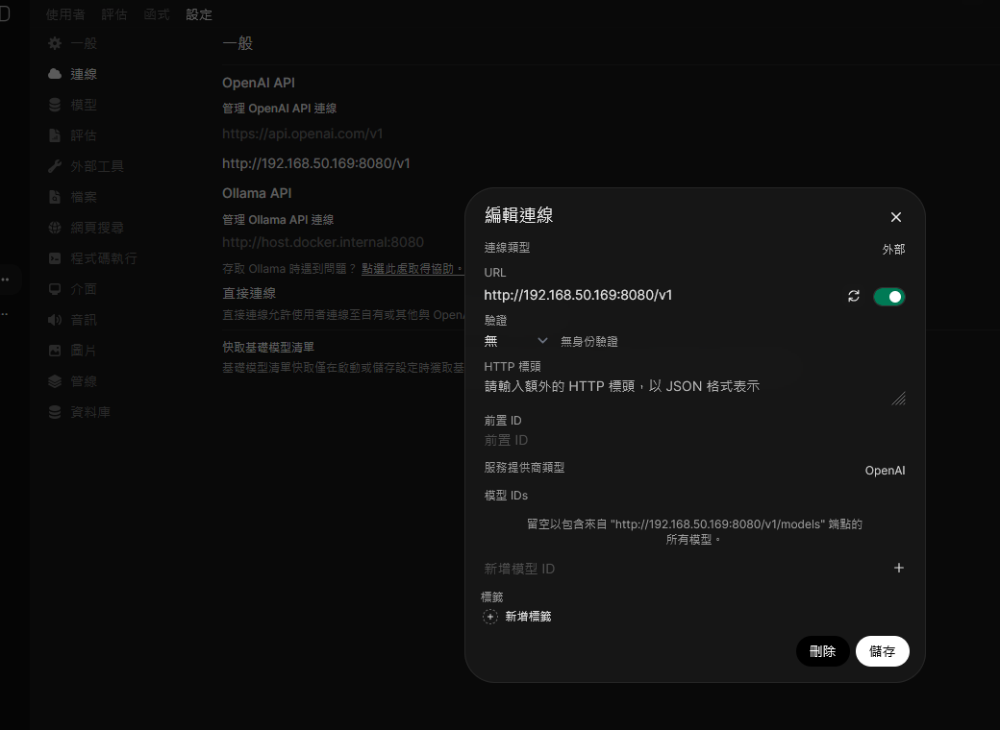
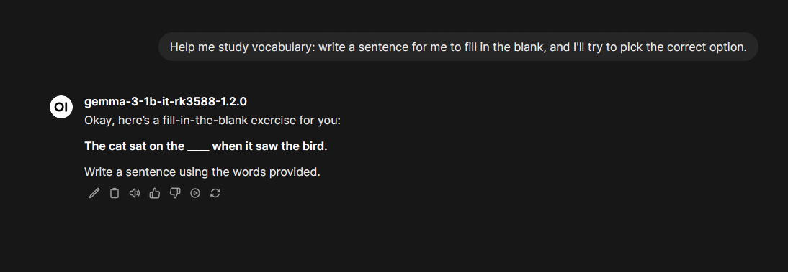

# llmserver-rs [](https://deps.rs/repo/github/darkautism/llmserver-rs)

A Rust-based, OpenAI-style API server for large language models (LLMs) that can run on the Rknpu

## Description

This project provides a Rust implementation of an API server that mimics the functionality of OpenAI's LLM API. It allows users to interact with large language models directly from their applications, leveraging the performance and safety of Rust.

## Features

- **OpenAI-style API**: Compatible with OpenAI's API endpoints for easy integration.
- **Rust Language**: Utilizes Rust for its performance, safety, and concurrency features.
- **Hardware Compatibility**: Specifically designed to run on the rknpu, powered by the rk3588 chip.

## Installation

You must need rknpu driver above 0.9.7.
To install and run `llmserver-rs`, follow these steps:

**Install dep packages:**
```bash
sudo apt update
sudo apt install clang curl libssl-dev pkg-config cmake libsentencepiece-dev libsentencepiece0 -y
```

**Install rknn.so and rkllm.so:**
```bash
sudo curl -L https://github.com/airockchip/rknn-llm/raw/refs/heads/main/rkllm-runtime/Linux/librkllm_api/aarch64/librkllmrt.so -o /lib/librkllmrt.so
sudo curl -L https://github.com/airockchip/rknn-toolkit2/raw/refs/heads/master/rknpu2/runtime/Linux/librknn_api/aarch64/librknnrt.so -o /lib/librknnrt.so
```

**Clone the Repository**:
```bash
git clone https://github.com/darkautism/llmserver-rs
```
**Build the Project:**
```bash
cd llmserver-rs
cargo build --release
```
**Run the Server:**
```bash
./target/release/llmserver kautism/DeepSeek-R1-Distill-Qwen-1.5B-RK3588S-RKLLM1.1.4
```

## Install on cluster

You need to find out which sbc in your cluster is cpu rk3588

```bash
yourname@hostname$ microk8s kubectl get nodes
NAME                STATUS   ROLES    AGE     VERSION
kautism-desktop     Ready    <none>   16d     v1.32.2
kautism-orangepi5   Ready    <none>   6d16h   v1.32.2
```

Label your node
```bash
microk8s kubectl label nodes <node-name> cpu=rk3588
```

Apply your yaml, if you don't know how to write it, you can copy `k8s/*` as template

```bash
yourname@hostname$ microk8s kubectl apply -f k8s/deepseek-1.5b.yaml
persistentvolumeclaim/llmserver-pvc created
deployment.apps/llmserver created
service/llmserver-service created
```

**Note**: My yaml use rock-ceph as backend pvc provider. You can change it you liked. Or you can follow [this guide](https://microk8s.io/docs/how-to-ceph) to build your own cluster storage system
**Note**: [error maybe happened](https://github.com/canonical/microk8s/issues/4314#issuecomment-1873823537)

Now you can see pod in your default namespace(if you do not like default namespace, change it by yourself).

```bash
sudo microk8s kubectl get all
NAME                                    READY   STATUS    RESTARTS      AGE
pod/llmserver-7bb666876d-9nzn6          1/1     Running   0             37s


NAME                        TYPE        CLUSTER-IP       EXTERNAL-IP   PORT(S)        AGE
service/llmserver-service   NodePort    10.152.183.39    <none>        80:31106/TCP   12m
```

Using any ip of your cluster node with node port to access your llm api

http://*<*your node ip not cluster ip*>*:31106/swagger-ui/

## Support module

llmserver support all of pure text to text model now. You can write your own config place in [assets/config](assets/config).


Here is tested model and default suppored.

You can add more config to support your model.

### Text generation model

All of module large than 7b will not work on 8G version

| Model Name | Size |
| --- | --- |
| [deepseek-r1:7b-qwen-distill-1.5b](https://huggingface.co/kautism/DeepSeek-R1-Distill-Qwen-1.5B-RK3588S-RKLLM1.1.4) | 2.04GB |
| [deepseek-r1:7b-qwen-distill-7b](https://huggingface.co/kautism/kautism/DeepSeek-R1-Distill-Qwen-7B-RK3588S-RKLLM1.1.4) | 8.19GB |
| [gemma-3:1b](https://huggingface.co/thanhtantran/gemma-3-1b-it-rk3588-1.2.0) | 1.63GB |
| [qwen2.5:7b-coder-instruct](https://huggingface.co/c01zaut/Qwen2.5-Coder-7B-Instruct-rk3588-1.1.2) | 4.98GB |
| [qwen3:4b-instruct](https://huggingface.co/dulimov/Qwen3-4B-Instruct-2507-rk3588-1.2.2) | 8.69GB |
| [seed-coder:8b](https://huggingface.co/limcheekin/seed-coder-8b-rk3588-16k.w8a8.rkllm) | 8.93GB |
| [qwen2:3b](https://huggingface.co/thanhtantran/Vi-Qwen2-3B-RAG-rk3588-1.2.0) | 3.74GB |


### Speech to text model
| Model Name | Size |
| --- | --- |
| [happyme531/SenseVoiceSmall-RKNN2](https://huggingface.co/happyme531/SenseVoiceSmall-RKNN2) | 486MB |


## Usage

You can access the online documentation at http://localhost:8080/swagger-ui/, which includes request examples and curl demo code.

The API server provides the following endpoints:

- /v1/chat/completions: Generate chat completions for conversational AI.
- /v1/audio/transcriptions: Speech Recognition 

### Usage example

#### Using with webui

Going to your openwebui, `admin control panel` -> `settings` -> `connections` -> `manager new connection` -> Type http://YourIP:8080/v1 in your url panel



Select your model to chat




#### API

Server side:
```Bash
yourname@hostname$ cargo run happyme531/SenseVoiceSmall-RKNN2
[2025-03-20T07:55:18Z INFO  hf_hub] Using token file found "/home/kautism/.cache/huggingface/token"
[2025-03-20T07:55:27Z INFO  actix_server::builder] starting 8 workers
[2025-03-20T07:55:27Z INFO  actix_server::server] Actix runtime found; starting in Actix runtime
[2025-03-20T07:55:27Z INFO  actix_server::server] starting service: "actix-web-service-0.0.0.0:8080", workers: 8, listening on: 0.0.0.0:8080
[2025-03-20T07:57:59Z INFO  actix_web::middleware::logger] 127.0.0.1 "POST /v1/audio/transcriptions HTTP/1.1" 400 150 "-" "curl/8.9.1" 0.017539
TempFile { file: NamedTempFile("/tmp/.tmpgH49L9"), content_type: Some("application/octet-stream"), file_name: Some("output.wav"), size: 1289994 }
Text("SenseVoiceSmall")
[2025-03-20T07:58:20Z INFO  actix_web::middleware::logger] 127.0.0.1 "POST /v1/audio/transcriptions HTTP/1.1" 200 638 "-" "curl/8.9.1" 2.596680
```

Client Side:(please change your wav path)
```Bash
yourname@hostname$ curl http://localhost:8080/v1/audio/transcriptions -H "Content-Type: multipart/form-data"   -F file="@/home/kautism/.cache/huggingface/hub/models--happyme531--SenseVoiceSmall-RKNN2/snapshots/01bc98205905753b7caafd6da25c84fba2490b59/output.wav"   -F model="SenseVoiceSmall"

{"text":"大家好喵今天给大家分享的是在线一线语音生成网站的合集能够更加方便大家选择自己想要生成的角色四进入网站可以看到所有的生成模型都在这里选择你想要深层的角色点击进入就来到我频到了生成的页面在文本框内输入你想要生成的内容然后点击生成就好了另外呢因为每次的生成结果都会更都会有一些不一样的地方如果您觉得第一次的生成效果不好的话可以尝试重新生成也可以稍微调节一下像的住址再生成试试上使用时一定要遵守法律法规不可以损害刷害人的形象哦"}
```

#### Stream example

```
kautism@kautism-desktop:~$ curl -X 'POST'   'http://192.168.50.169:8080/v1/chat/completions'   -H 'accept: application/json'   -H 'Content-Type: application/json'   -d '{
  "messages": [
    {
      "content": "你是一個愚蠢的智慧音箱。除非使用者特別要求回答盡量短促。",
      "role": "developer"
    },
    {
      "content": "你好，請問5+3等於多少!",
      "role": "user"
    }
  ],
  "model": "Qwen2.5-Coder-7B",
  "stream" : true
}'
{"id":"123","object":"chat.completion.chunk","created":1763440094,"choices":[{"index":0,"message":{"role":"assistant","content":"你好"},"finish_reason":null}]}
{"id":"123","object":"chat.completion.chunk","created":1763440094,"choices":[{"index":0,"message":{"content":"！"},"finish_reason":null}]}
{"id":"123","object":"chat.completion.chunk","created":1763440094,"choices":[{"index":0,"message":{"content":"5"},"finish_reason":null}]}
{"id":"123","object":"chat.completion.chunk","created":1763440094,"choices":[{"index":0,"message":{"content":"加"},"finish_reason":null}]}
{"id":"123","object":"chat.completion.chunk","created":1763440094,"choices":[{"index":0,"message":{"content":"3"},"finish_reason":null}]}
{"id":"123","object":"chat.completion.chunk","created":1763440094,"choices":[{"index":0,"message":{"content":"等"},"finish_reason":null}]}
{"id":"123","object":"chat.completion.chunk","created":1763440094,"choices":[{"index":0,"message":{"content":"於"},"finish_reason":null}]}
{"id":"123","object":"chat.completion.chunk","created":1763440094,"choices":[{"index":0,"message":{"content":"8"},"finish_reason":null}]}
{"id":"123","object":"chat.completion.chunk","created":1763440094,"choices":[{"index":0,"message":{"content":"。"},"finish_reason":null}]}
{"id":"123","object":"chat.completion.chunk","created":1763440094,"choices":[{"index":0,"message":{"content":"有"},"finish_reason":null}]}
{"id":"123","object":"chat.completion.chunk","created":1763440094,"choices":[{"index":0,"message":{"content":"其他"},"finish_reason":null}]}
{"id":"123","object":"chat.completion.chunk","created":1763440094,"choices":[{"index":0,"message":{"content":"問題"},"finish_reason":null}]}
{"id":"123","object":"chat.completion.chunk","created":1763440094,"choices":[{"index":0,"message":{"content":"需要"},"finish_reason":null}]}
{"id":"123","object":"chat.completion.chunk","created":1763440094,"choices":[{"index":0,"message":{"content":"幫助"},"finish_reason":null}]}
{"id":"123","object":"chat.completion.chunk","created":1763440094,"choices":[{"index":0,"message":{"content":"嗎"},"finish_reason":null}]}
{"id":"123","object":"chat.completion.chunk","created":1763440094,"choices":[{"index":0,"message":{"content":"？"},"finish_reason":null}]}
{"id":"123","object":"chat.completion.chunk","created":1763440094,"choices":[{"index":0,"message":{},"finish_reason":"Stop"}]}
```

## Model Config format

```
{
    "model_repo": "kautism/DeepSeek-R1-Distill-Qwen-1.5B_w8a8_g128_rk3588.rkllm",
    "model_name": "DeepSeek-R1-Distill-Qwen-1.5B",
    "model_type" : "LLM",
    "model_path": "DeepSeek-R1-Distill-Qwen-1.5B_w8a8_g128_rk3588.rkllm",
    "local_repo": "/data/models/{model_name}",
    "think" : false
}
```
model_repo : The repo id in the huggingface, llmserver will clone your model from this path.
model_name : Model name showing in the API. This field will affect display name in webui.
model_type : One of LLM/ASR.
model_path : The real rkllm file in the repository. Supports `{model_name}` placeholder.
tokenizer_repo : Some of repository do not provider tokenizer_config.json but just provider the model file, thus you need this field. This field is option.
local_repo : Optional local source directory for this model. Supports `{model_name}` placeholder. When set, llmserver resolves model file as `<local_repo>/<model_path|model.rkllm>` and uses `<local_repo>` as tokenizer path by default.
think      : Enable think feature. Some of application which very care response time is not fit think feature.

### Local model (clean config)
If you want local models without repeating the model name in multiple fields, use `local_repo`:

```
{
    "model_repo": "kautism/Qwen2.5-3B-abliterated-rk3588",
    "model_name": "Qwen2.5-3B-abliterated",
    "model_type": "LLM",
    "model_path": "Qwen2.5-3B-abliterated-16k-rk3588.rkllm",
    "local_repo": "/home/kautism/llmserver-rs/{model_name}",
    "think": false
}
```
Use `local_repo` as the single local source field; it keeps config minimal and avoids duplicate path settings.


## License
This project is licensed under the MIT License.

## Acknowledgements

[OpenAI](https://platform.openai.com/docs/api-reference) for their pioneering work in LLM APIs.
